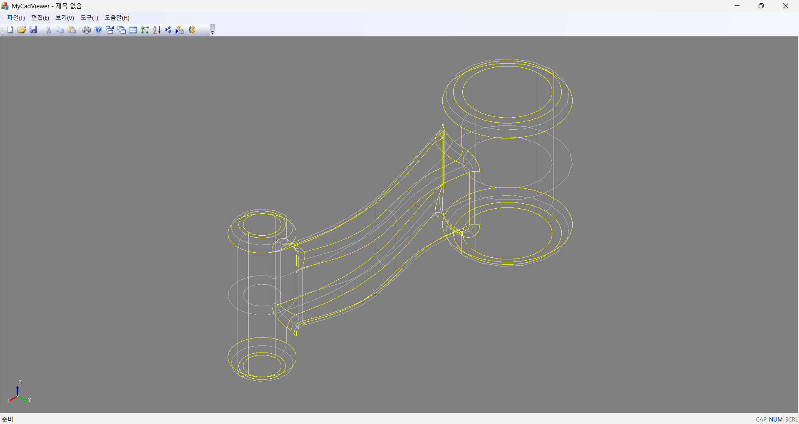
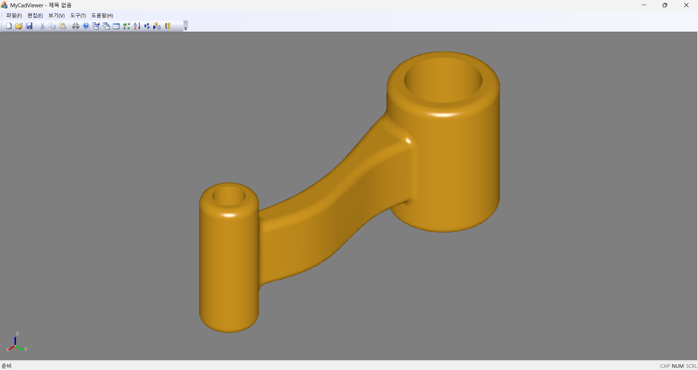
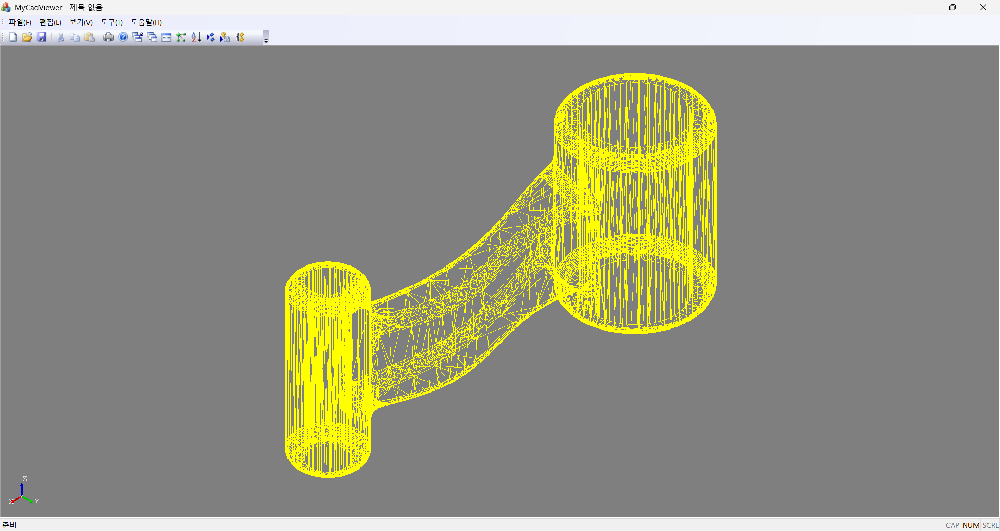

# MyCadViewer

MyCadViewer는 MFC + OpenCascade(OCCT) 기반의 Windows CAD STEP 뷰어 샘플 프로젝트입니다.

## 개발 환경

- Visual Studio 2026 (VC++ toolset)
- Windows 64-bit
- OpenCascade 7.9.3 (Debug 포함 패키지)

## OpenCascade 설치/연결

1. 아래 릴리즈 페이지로 이동합니다.
   - https://dev.opencascade.org/release
2. 다음 ZIP 파일을 다운로드합니다.
   - `Windows package with debug and 3rd-party VC++ 2022 64 bit: opencascade-7.9.3-vc14-64-with-debug-combined.zip`
3. 원하는 경로에 압축을 해제합니다.
4. 환경 변수 `OCCT_ROOT`를 **ZIP을 풀어낸 상위 폴더 경로**(즉, `opencascade-7.9.3-vc14-64-with-debug-combined` 폴더를 포함하고 있는 경로)로 설정합니다.

예시:

- `OCCT_ROOT=C:\libs`  
  (이 경우 OCCT는 `C:\libs\opencascade-7.9.3-vc14-64-with-debug-combined\...` 에 위치해야 합니다.)

## 빌드

1. Visual Studio에서 솔루션(`MyCadViewer.slnx`)을 엽니다.
2. `x64` / `Debug` 또는 `Release` 구성 선택
3. 빌드 후 실행

> 참고: 프로젝트 파일은 `%OCCT_ROOT%\opencascade-7.9.3-vc14-64-with-debug-combined\`를 기준으로 include/lib 경로를 사용합니다.

## 현재 기능

- STEP / STL 파일 열기
- 기본 뷰 조작(회전/이동/줌)
- Wireframe / Shaded 전환
- STEP 파일을 STL로 내보내기(Export) 지원
   - `CadViewer.ini`로 메쉬 정밀도(Deflection/Angle 등)와 바이너리/ASCII를 세분화 설정 가능

## INI 설정 (CadViewer.ini)

실행 파일(`MyCadViewer.exe`)과 같은 폴더에 `CadViewer.ini`가 있으며, 항목이 없으면 **기본값을 자동으로 기록**합니다.

### ViewerMesh (화면 표시용 빠른 메쉬)

STEP/STL 로드 후 화면 표시 속도/품질 밸런스를 위해 사용하는 메쉬 파라미터입니다.

```ini
[ViewerMesh]
Deflection=0.2
AngleDeg=28
Relative=1
Parallel=1
MinSize=0
CleanBeforeMesh=0
```

### StlExport (STL 내보내기 정밀도)

메뉴 **파일(F) → STL로 내보내기(E)...** 실행 시 아래 설정을 읽어 STL을 생성합니다.
(즉, STEP로 로드한 형상을 STL로 내보낼 때도 이 정밀도 설정이 그대로 적용됩니다.)

```ini
[StlExport]
Deflection=0.01
AngleDeg=12
Relative=1
Parallel=1
MinSize=0
CleanBeforeMesh=1
Binary=1
```

#### 주요 파라미터 의미

- `Deflection`: 값이 작을수록 더 촘촘한 삼각형 메쉬(정밀도↑ / 용량↑ / 시간↑)
- `AngleDeg`: 값이 작을수록 곡면을 더 잘 따라가도록 분할(정밀도↑ / 용량↑)
- `Binary`: `1`이면 Binary STL, `0`이면 ASCII STL

## 화면 예시

### STEP 파일 - Wireframe



### STEP 파일 - Shaded



### STL 파일 - Wireframe (Mesh 와이어 표시)


